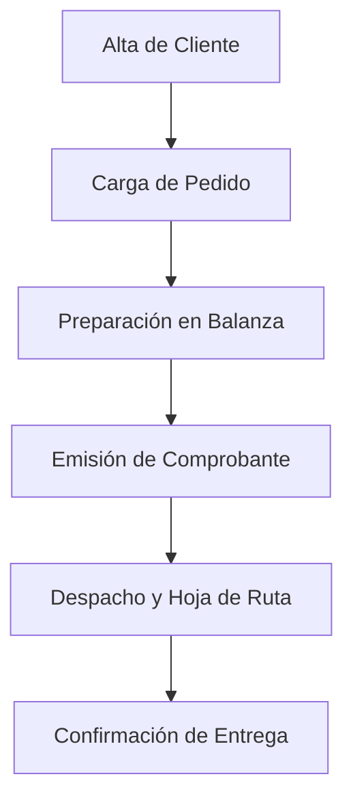

# Manual de Uso: Flujo Operativo FrigoApp

Este manual describe el proceso "End-to-End" desde el alta de un cliente hasta la entrega de la mercadería en destino.

## 1. Diagrama de Proceso Principal

---

## 2. Paso a Paso Detallado

### Paso 1: Alta de Cliente (Módulo Clientes)
El proceso comienza registrando al cliente en el sistema.
- **Acción:** Ir a `Admin > Clientes`.
- **Datos Clave:** Razón Social, CUIT (para facturación), Dirección de entrega y **Ruta Logística** asignada.
- **Carga Masiva (Recomendado):** 
    - Use el botón **"Plantilla"** para descargar el formato CSV.
    - El sistema permite **"Actualización Inteligente (Upsert)"**: si sube un cliente con un CUIT o Razón Social existente, sus datos se actualizarán (útil para asociar IDs de WhatsApp masivamente).
- **Importante:** La ruta determina qué transportista verá el pedido en su hoja de ruta.

### Paso 2: Carga del Pedido (Módulo Pedidos)
Se registran los productos y cantidades estimadas que el cliente solicita.
- **Acción:** Ir a `Ventas > Pedidos`.
- **Proceso:** Seleccionar cliente, agregar productos (unidades/piezas) y definir fecha de entrega.
- **Nota:** El precio se toma automáticamente de la *Lista de Precios* asociada al cliente.

### Paso 3: Preparación y Balanza (Módulo Preparación)
En el frigorífico, se preparan los cortes físicos y se pesan.
- **Acción:** El operario de balanza entra a `Ventas > Preparación`.
- **Proceso:** Selecciona la orden, inicia la preparación y carga los **Kilos Reales** de cada bulto. 
- **Cierre:** Una vez pesados todos los ítems, se marca como "Finalizar Preparación".

### Paso 4: Facturación (Módulo Comprobantes)
Con los pesos reales confirmados, se genera el documento legal.
- **Acción:** Ir a `Ventas > Facturación`.
- **Proceso:** Los pedidos preparados aparecerán en la lista de "Pendientes". Se selecciona el pedido y se opta por generar una **Factura (AFIP)** o un **Remito Interno**.
- **Resultado:** El sistema calcula el total final basado en los kilos exactos de balanza.

### Paso 5: Despacho y Entrega (Módulo Despacho)
El transportista gestiona la logística final.
- **Acción:** Acceso desde `Ventas > Despacho` (optimizado para móviles).
- **Proceso:** El chofer ve su "Hoja de Ruta" con todos los repartos del día. 
- **Confirmación:** Al llegar al cliente, registra novedades (si las hay) y solicita la **Firma Digital** en pantalla.

---

## 3. Identificación Persistente de WhatsApp
Para que el sistema asocie automáticamente los mensajes al cliente correcto, se utiliza un **ID de WhatsApp (LID/JID)**.

### A. Vinculación Automática (Self-Healing)
El sistema es inteligente. La primera vez que un cliente te escriba (si ya está cargado en tu lista con su número de celular), el bot:
1. Buscará al cliente por su número.
2. Extraerá su ID único de WhatsApp.
3. **Guardará automáticamente** ese ID en la ficha del cliente. 
4. A partir de allí, la identificación será instantánea y 100% precisa.

### B. Vinculación Manual
Si un pedido aparece como **"DESCONOCIDO"**:
1. En el panel de WhatsApp, verás un botón de **Copiar** al lado del ID (ej: `22436925939911@lid`).
2. Copia el ID y pégalo en el campo **"ID de WhatsApp"** editando al cliente correspondiente.

---

## 4. Gestión del Bot de WhatsApp
El sistema integra WhatsApp sin necesidad de un navegador abierto.
- **Estado del Servicio:** Verificable en `Admin > WhatsApp`.
- **Vincular Sesión:** Si el servicio está desconectado, se mostrará un código QR. Escanéelo desde dispositivos vinculados en su teléfono.
- **Cerrar Sesión (Logout):** Use el botón **"Cerrar Sesión"** para desvincular el teléfono actual y generar un nuevo QR. El sistema se reiniciará automáticamente.
- **Detección Automática (IA):** El sistema utiliza GPT-4o para entender el pedido. También procesa **Notas de Voz**.
- **Validación:** Los pedidos recibidos aparecen en "Pedidos Detectados". Puede revisar y editar el pedido antes de presionar **"Validar Pedido"**.

---

## 5. Estados del Pedido
- **Pendiente de Validación:** Pedido recibido por WhatsApp, esperando revisión humana.
- **Pendiente:** Creado, esperando ser preparado.
- **En Preparación:** Siendo pesado en balanza.
- **Preparado:** Pesos cargados, listo para facturar.
- **Despachado:** Documento emitido, en viaje.
- **Entregado:** Proceso finalizado con firma del cliente.

> [!TIP]
> Use el **Dashboard** para ver el estado general de la operación en tiempo real y detectar cuellos de botella. La nueva **Búsqueda Avanzada** en clientes permite filtrar por CUIT o Razón Social instantáneamente.
